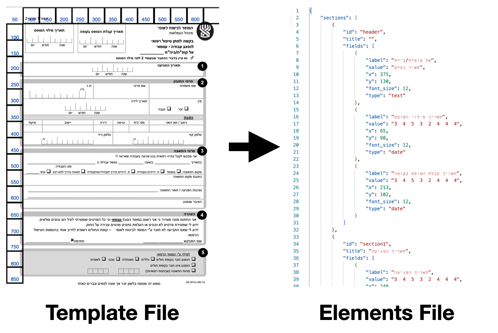
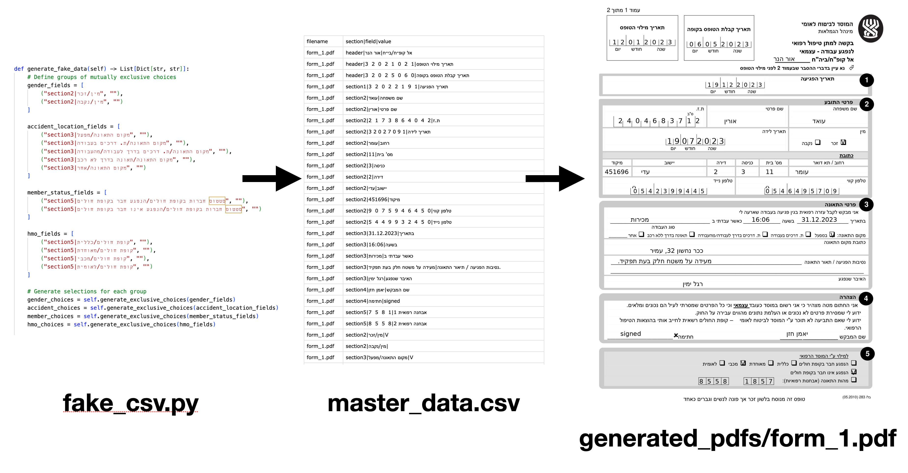
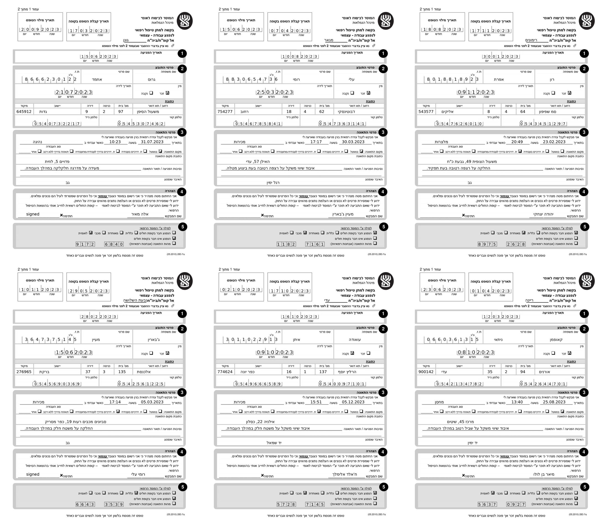
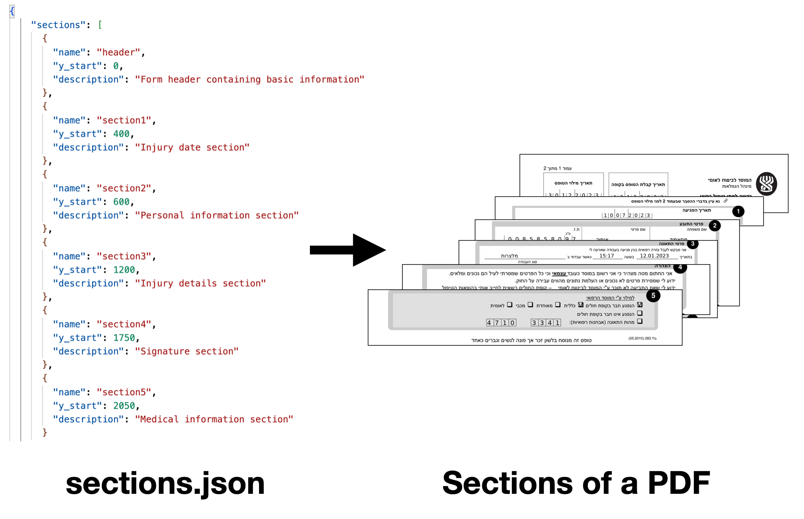

# Healthcare Form Processing and Q&A System

This project consists of two main components:
1. OCR Processing System for Healthcare Forms
2. Healthcare Information Q&A System

## Projects Structure

```
├── ocr_project/        # OCR Form Processing System
│   ├── core/           # Core OCR processing functionality
│   ├── services/       # Service-level implementations
│   ├── web/            # Web interface for OCR processing
│   └── resources/      # Configuration and resource files
│
├── Q&A/                # Healthcare Q&A System
    ├── qna_project/    # Main Q&A implementation
    ├── resources/      # Q&A resources and configurations
    └── web/            # Web interface for Q&A system
```

## Projects Overview

### Generate Synthetic Files

Before creating the OCR process, I focus on creating synthetic PDF files so I would be able to evaluate the OCR pipeline.

#### Stage 1: Cordinates Mapping

First, I mapped for each component in the PDF file the coordinates where everything is located in the PDF. You can take a look in the [form_elements.json](https://github.com/ofirsteinherz/ocr-q-a/blob/main/ocr_project/resources/form_elements.json) file. For each field, we have the coordinates, text, and section. That structure will help us in the upcoming parts, with Microsoft Document Analyzer and GPT services.



#### Stage 2: Fake Data Creation

Created [fake_csv.py](https://github.com/ofirsteinherz/ocr-q-a/blob/main/ocr_project/ocr_project/utils/fake_csv.py) which have these capabilities:

- Generates realistic Hebrew names
- Creates valid ID numbers
- Generates formatted dates
- Produces valid phone numbers
- Creates random addresses
- Handles checkbox selections

The PDFs themselfs are created with [form_processor.py](https://github.com/ofirsteinherz/ocr-q-a/blob/main/ocr_project/ocr_project/core/form_processor.py) file.

#### Stage 3: PDFs Creation 

Given the coordinates and the fake CSV, I created with [gen_files.py](https://github.com/ofirsteinherz/ocr-q-a/blob/main/ocr_project/ocr_project/services/gen_files.py) 100 PDFs that would be used as a supervised evaluation of the OCR pipeline.



To generate synthetic PDFs, use the CLI command:

```bash
python -m ocr_project.services.gen_files
```




### OCR Processing

#### Stage 1: Split Into Sections

After a lot of debugging, I found out that [Azure AI Document Intelligence](https://azure.microsoft.com/en-us/products/ai-services/ai-document-intelligence/) has a hard time handling full documents well without fine-tuning the model. I decided to handle each section of the PDF individually. [split_pdf.py](https://github.com/ofirsteinherz/ocr-q-a/blob/main/ocr_project/ocr_project/processors/split_pdf.py#L73) file was used for tests, in the OCR process the file [extract_form_fields.py](https://github.com/ofirsteinherz/ocr-q-a/blob/main/ocr_project/ocr_project/core/extract_form_fields.py) uses [sections.json](https://github.com/ofirsteinherz/ocr-q-a/blob/main/ocr_project/resources/sections.json) schema.



#### Stage 2: Analyze Each Section

For each section of the PDF, we send it into the Microsoft Document Intelligence, and then to make the result better we send it to GPT-4o. From the example I provided, you can see that GPT made the OCR process much better (the texts is taken from different PDF). You can see the full pipeline in [extract_form_fields.py](https://github.com/ofirsteinherz/ocr-q-a/blob/main/ocr_project/ocr_project/core/extract_form_fields.py) file.


#### Stage 3: OCR Results

For each OCR, I added some more manipulation and this is the final JSON result:

```json
{
  "header": {
    "title": "Form Header",
    "fields": [
      {
        "label": "אל קופ״ח/בי״ח",
        "value": "אור הנר"
      },
      {
        "label": "תאריך מילוי הטופס",
        "value": "12/01/2023"
      },
      {
        "label": "תאריך קבלת הטופס בקופה",
        "value": "06/05/2023"
      }
    ]
  },
  "section1": {
    "title": "תאריך הפגיעה",
    "fields": [
      {
        "label": "תאריך הפגיעה",
        "value": "20/03/2023"
      }
    ]
  },
  ...
}
```

To run the OCR, use the CLI command:

```bash
python3 -m ocr_project.services.run_ocr
```


### Evaluate Results

#### Stage 1: Comparing Each Field

To evaluate the OCR results I looked for a match in the master csv we creaetd before to the extracted texts:

| **filename** | **section** | **field**                    | **expected_value**           | **extracted_value** | **normalized_expected** | **normalized_extracted** | **matches** |
| ------------ | ----------- | ---------------------------- | ---------------------------- | ------------------- | ----------------------- | ------------------------ | ----------- |
| form_1.pdf   | header      | אל קופ״ח/בי״ח                | אור הנר                      |                     | אורהנר                  |                          | FALSE       |
| form_1.pdf   | header      | תאריך מילוי הטופס            | 1 2 0 1 2 0 2 3              | 12/01/2023          | 12012023                | 12012023                 | TRUE        |
| form_1.pdf   | header      | תאריך קבלת הטופס בקופה       | 0 6 0 5 2 0 2 3              | 06/05/2023          | 06052023                | 06052023                 | TRUE        |
| form_1.pdf   | section1    | תאריך הפגיעה                 | 1 9 1 2 2 0 2 3              | 20/02/1913          | 19122023                | 20021913                 | FALSE       |
| form_1.pdf   | section2    | שם משפחה                     | עואד                         | עואד                | עואד                    | עואד                     | TRUE        |
| form_1.pdf   | section2    | שם פרטי                      | אורין                        | אורין               | אורין                   | אורין                    | TRUE        |
| form_1.pdf   | section2    | ת.ז                          | 2 4 0 4 6 8 3 7 1 2          | 240468371           | 2404683712              | 240468371                | FALSE       |
| form_1.pdf   | section2    | תאריך לידה                   | 1 9 0 7 2 0 2 3              | 19/07/2023          | 19072023                | 19072023                 | TRUE        |
| form_1.pdf   | section2    | רחוב                         | עומר                         | עומר                | עומר                    | עומר                     | TRUE        |
| form_1.pdf   | section2    | מס' בית                      | 11                           | 11                  | 11                      | 11                       | TRUE        |
| form_1.pdf   | section2    | כניסה                        | 3                            | 3                   | 3                       | 3                        | TRUE        |
| form_1.pdf   | section2    | דירה                         | 2                            | 2                   | 2                       | 2                        | TRUE        |
| form_1.pdf   | section2    | יישוב                        | עדי                          | עדי                 | עדי                     | עדי                      | TRUE        |
| form_1.pdf   | section2    | מיקוד                        | 451696                       | 451696              | 451696                  | 451696                   | TRUE        |
| form_1.pdf   | section2    | טלפון קווי                   | 0 5 4 6 4 9 5 7 0 9          | 046495709           | 0546495709              | 046495709                | FALSE       |
| form_1.pdf   | section2    | טלפון נייד                   | 0 5 4 2 3 9 9 4 4 5          | 0542399445          | 0542399445              | 0542399445               | TRUE        |
| form_1.pdf   | section3    | בתאריך                       | 31.12.2023                   | 31/12/2023          | 31122023                | 31122023                 | TRUE        |
| form_1.pdf   | section3    | בשעה                         | 16:06                        | 16:06               | 16:06                   | 16:06                    | TRUE        |
| form_1.pdf   | section3    | כאשר עבדתי ב                 | מכירות                       | מכירות              | מכירות                  | מכירות                   | TRUE        |
| form_1.pdf   | section3    | נסיבות הפגיעה / תיאור התאונה | מעידה על משטח חלק בעת תפקיד. |                     | מעידהעלמשטחחלקבעתתפקיד. |                          | FALSE       |
| form_1.pdf   | section3    | האיבר שנפגע                  | רגל ימין                     | רגל ימין            | רגלימין                 | רגלימין                  | TRUE        |

As you can see, we can add more manipulation to the extracted and the original data, and we will manage to get better results.

#### Stage 2: Statictics

For each section,I showed the sucess presentage. the data sicentist and the client can see and make changes to the OCR pipelines and the PDF format so the confidence would be better.

```
=== Comparison Report ===
Total files processed: 4
Total fields processed: 152
Fields matched: 117
Overall match rate: 76.97%

Section Statistics:

header:
  Total fields: 12
  Matched fields: 5
  Match rate: 41.67%

section1:
  Total fields: 4
  Matched fields: 2
  Match rate: 50.00%

section2:
  Total fields: 56
  Matched fields: 46
  Match rate: 82.14%

section3:
  Total fields: 40
  Matched fields: 30
  Match rate: 75.00%

section4:
  Total fields: 8
  Matched fields: 8
  Match rate: 100.00%

section5:
  Total fields: 32
  Matched fields: 26
  Match rate: 81.25%

File Statistics:

form_1.pdf:
  Total fields: 38
  Matched fields: 32
  Match rate: 84.21%

form_2.pdf:
  Total fields: 38
  Matched fields: 28
  Match rate: 73.68%

form_3.pdf:
  Total fields: 38
  Matched fields: 28
  Match rate: 73.68%

form_4.pdf:
  Total fields: 38
  Matched fields: 29
  Match rate: 76.32%
```


2. Run Web Interface


## Prerequisites

- Python 3.8 or higher
- Azure Cognitive Services subscription (for OCR and GPT services)
- Azure Form Recognizer service
- Azure OpenAI service

## Installation

1. Clone the repository:
```bash
git clone https://github.com/ofirsteinherz/ocr-q-a
cd ocr-q-a
```

2. Create and activate a virtual environment:
```bash
python -m venv venv
source venv/bin/activate  # On Windows: venv\Scripts\activate
```

3. Install requirements for both projects:
```bash
pip install -r ocr_project/requirements.txt
pip install -r Q&A/requirements.txt
```

I didn't have sufficient time to set up a new VM to verify if the required files are compatible with the codebase.

4. Set up environment variables:
    Create a `.env` file in the root directory with:

```
AZURE_DOCUMENT_ENDPOINT=your_form_recognizer_endpoint
AZURE_DOCUMENT_KEY=your_form_recognizer_key
AZURE_OPENAI_API_KEY=your_openai_key
AZURE_OPENAI_ENDPOINT=your_openai_endpoint
```

## OCR Project Usage

### 1. Generate Synthetic Files
Generate synthetic PDF files for testing:
```bash
python -m ocr_project.services.gen_files
```

### 2. Run OCR Processing
Process the generated PDF files:
```bash
python -m ocr_project.services.run_ocr
```

### 3. Evaluate Results
Compare OCR results with expected values:
```bash
python -m ocr_project.services.compare_service
```

### 4. Run Web Interface
Start the OCR web interface:
```bash
python -m ocr_project.web.app
```

## Q&A System Usage

### 1. Process HTML Resources
Process the HTML files containing healthcare information:
```bash
python -m qna_project.services.html_service
```

### 2. Search Customer Information
Test customer information search functionality:
```bash
python -m qna_project.services.search_customer
```

### 3. Run Q&A Interface
Start the Q&A web interface:
```bash
streamlit run qna_project/web/streamlit/main.py
```

## Project Components

### OCR Project
- Form Processing: Extracts information from healthcare forms using Azure Form Recognizer
- Field Validation: Validates extracted data against expected formats
- Web Interface: Flask-based interface for uploading and processing forms
- Evaluation: Compares extracted data with expected values

### Q&A System
- Healthcare Information Processing: Processes structured healthcare information from HTML
- Customer Service Integration: Manages customer data and service queries
- Interactive Interface: Streamlit-based chat interface for healthcare inquiries
- Dynamic Response Generation: Uses Azure OpenAI for natural language interaction

## Directory Structure Details

### OCR Project
```
ocr_project/
├── core/
│   ├── document_analyzer.py    # Azure Form Recognizer integration 
│   ├── extract_form_fields.py  # Field extraction logic
│   ├── form_processor.py       # Form processing utilities
│   └── gpt_client.py           # GPT integration
├── services/
│   ├── run_ocr.py              # OCR service runner
│   ├── gen_files.py            # Synthetic file generator
│   └── compare_service.py      # Results evaluation
└── web/
    ├── app.py                  # Web interface
    └── templates/              # HTML templates
```

### Q&A Project
```
Q&A/
├── qna_project/
│   ├── clients/              # API clients
│   ├── config/               # Configuration
│   ├── processors/           # Data processors
│   ├── services/             # Business logic
│   └── web/                  # Web interface
└── resources/
    ├── prompts/              # System prompts
    └── raw_html/             # Healthcare information
```

## Configuration

### OCR Configuration
- Form templates in `ocr_project/resources/`
- OCR settings in `ocr_project/config/settings.py`
- Web interface configuration in `ocr_project/web/app.py`

### Q&A Configuration
- Healthcare data in `Q&A/resources/raw_html/`
- Q&A prompts in `Q&A/resources/prompts/`
- System settings in `Q&A/qna_project/config/settings.py`

## Error Handling

Both systems include comprehensive error handling:
- Input validation
- Service connection errors
- Processing failures
- Data validation errors

Logs are stored in the respective `logs` directories of each project.
